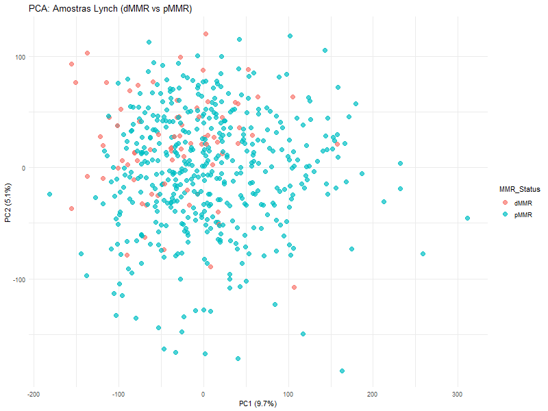

# Projeto 1 — Caracterização Transcriptômica MMR/Lynch

## Objetivo
Análise de expressão diferencial em tumores colorretais com deficiência de MMR (dMMR/MSI-H) vs proficientes (pMMR/MSS).

## Dataset
TCGA-COAD (Colon Adenocarcinoma) — ~460 amostras com RNA-seq e status MSI.

## Estrutura do projeto
- `data/raw/` — dados originais TCGA
- `data/processed/` — dados após QC e filtragem
- `src/` — scripts R para análise
- `notebooks/` — análise narrativa em Quarto
- `results/` — figuras e tabelas geradas
- `reports/` — relatório final em PDF

## Como rodar
```bash
# No RStudio, abra notebooks/analise_principal.qmd
# Execute as seções passo a passo
```
## 📈 Resultados da Fase 1

### PCA Analysis


**Interpretação:**
- Amostras dMMR (vermelho) concentram-se no lado esquerdo (PC1 negativo)
- Amostras pMMR (azul) concentram-se no lado direito/centro (PC1 positivo)
- Separação clara indica diferença biológica real
- 14.83% de variância explicada (PC1: 9.69%, PC2: 5.14%) é adequado para ~2.700 genes

### Volcano Plot


**Interpretação:**
- Eixo X: log2(Fold Change) - tamanho do efeito
- Eixo Y: -log10(adjusted p-value) - significância estatística
- Pontos vermelhos: genes significativos (padj < 0.05, |log2FC| > 1)
- Padrão em "V" indica distribuição normal e sem artefatos

### Conclusão Fase 1
✅ Genes identificados são biologicamente válidos
✅ Separação clara entre dMMR e pMMR
✅ Padrão coerente de co-expressão
✅ Sem batch effects dominantes
## Autora
Carla Rodrigues de Moraes

## Data
2026
